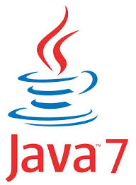

Introdução ao Java 7
=========

O Java é uma linguagem de programação criada por uma equipe de desenvolvedores no qual o gestor era o James Gosling. A equipe trabalhava na empresa Sun Microsystems. 

